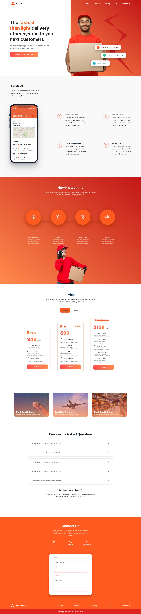

## Table of contents


- [Delivery Landing Page](#Delivery-lannding-page)
  - [Screenshot](#screenshot)
  - [Links](#links)
  - [My process](#my-process)
  - [Built with](#built-with)
  - [What I learned](#what-i-learned)
  - [Continued development](#continued-development)
  - [Useful resources](#useful-resources)
  - [Author](#author)
- [Acknowledgments](#acknowledgments)


# Delivery Landing Page

Users should be able to:

- View the optimal layout depending on their device's screen size

### Screenshot



### Links

Solution Url: (https://github.com/omobankole/Delivery-Landing-Page)
- [Figma Link](https://www.figma.com/file/YEFBxzuMjxA5k8tXSaOGTb/Untitled?node-id=0%3A6)

### My Process

## Built with

- Semantic HTML5 markup
- CSS custom properties
- Flexbox
- Javascript

### What I learned

happy to get started with some javascript properties in the project, and i hope to be best at it. I was able to know more flexbox properties whereas some sematics on html also for example:

```html
<section>Some HTML code I'm proud of</section>
```
```javascript
 hamburger.addEventListener('click', () =>
 ```
```css
.proud-of-this-css {
  flex-direction: column-reverse;
}
```

### Continued development

i want to focus more on media query, css grid, positioning and css animations and the complex part(javascript), moreso get prepared for what coming next.

### Useful resourses

- [Google Fonts](https://www.fonts.google.com) - This help me with the various fonts used in my project.
- [Image color picker](https://www.imagecolorpicker.com) - This ihelp me in picking colors from the design given to me.

## Auther

- Twitter - [@omobankole1](https://www.twitter.com/omobankole1)
- Github - [@omobankole](https://www.github.com/omobankole)

## Acknowledgments
 I really want to thank grazac academy again for giving me great opportunity to be one of their student in this ongoing cohort and secondly tutor mayowa for the smooth interactive and comprehended classes. Victor, Mr dare for putting me through and lastly my coursemates. you all are wonderful.


 